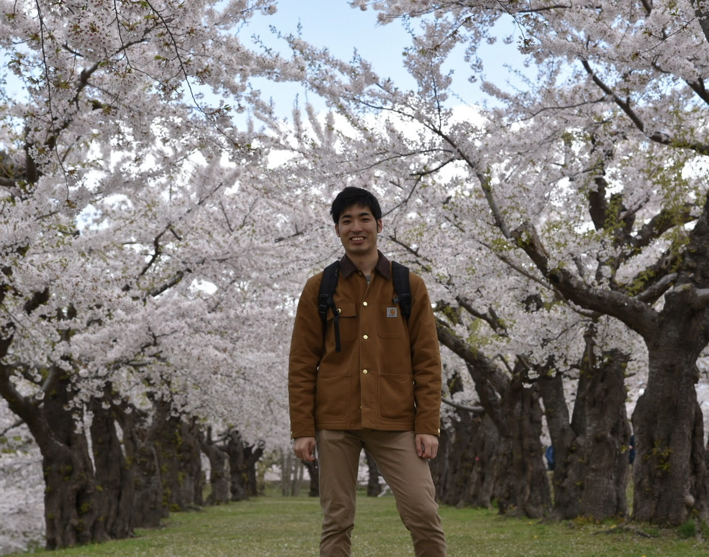

::: {style="text-align: center;"}

:::

 

## Profile

Postdoctoral researcher working at the <a href="https://ecological-integration.studio.site/" target="_blank">Kondoh Lab</a> in Tohoku University, Japan.\
Currently, I'm studying at the  in Hong Kong University of Science and Technology.

   

Email: tkmtohgs1031 at gmail.com

## Research Keywords

Soil microbial community, Environmental DNA, Community ecology, Time-series analysis

## Biography

-   1996: Born in Osaka and grew up in Nishinomiya, Hyogo, Japan
-   2015 \~ 2019: Faculty of Agriculture, Hokkaido University
-   2019 \~ 2021: Master course, Graduate School of Global Food Resources, Hokkaido University
-   2021 \~ 2024: Ph.D. course, Graduate School of Global Food Resources, Hokkaido University
-   2022: Visiting Scholar, The University of Minnesota
-   2024: Ph.D. (Food Resources), Hokkaido University
-   2024 \~ present: JSPS Research Fellow (PD) at Tohoku University (Kondoh Lab)

## Awards

-   **Excellent Poster Award (PhD student division)**, The 36th
Annual Meeting of Japanese Society for Microbial Ecology & The 13th Asian Symposium on Microbial
Ecology, Hamamatsu, Japan, November 2023
-   **English Presentation Audience Award**, The 68th Annual Meeting of
Ecological Society of Japan, Okayama, Japan, March 2021

## Funding/Fellowship

-   2021 \~ 2024: Hokkaido University-Hitachi Joint Cooperative Support Program for Education and Research
-   2024 \~ present: Grant-in-Aid for JSPS Fellows
